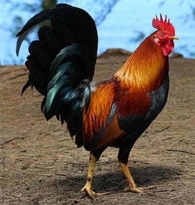
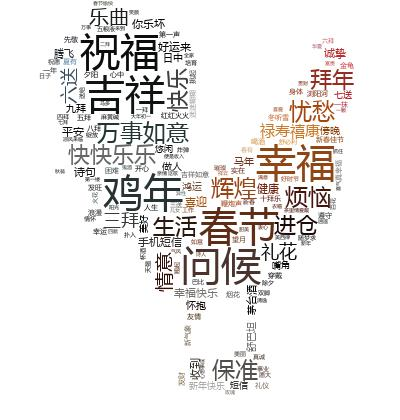
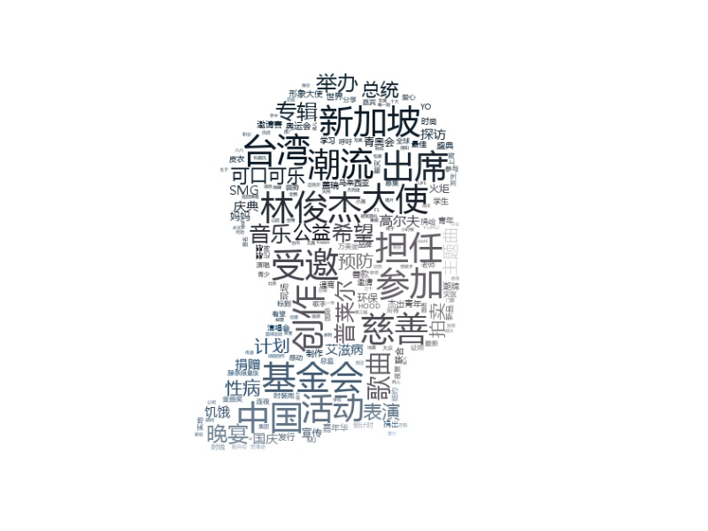
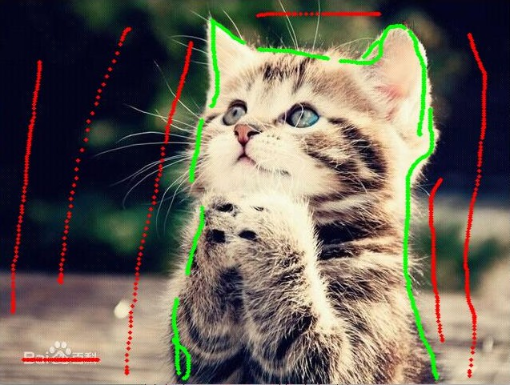
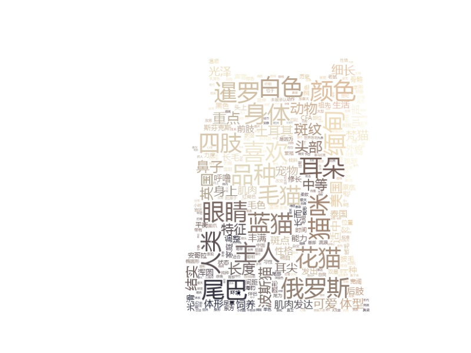
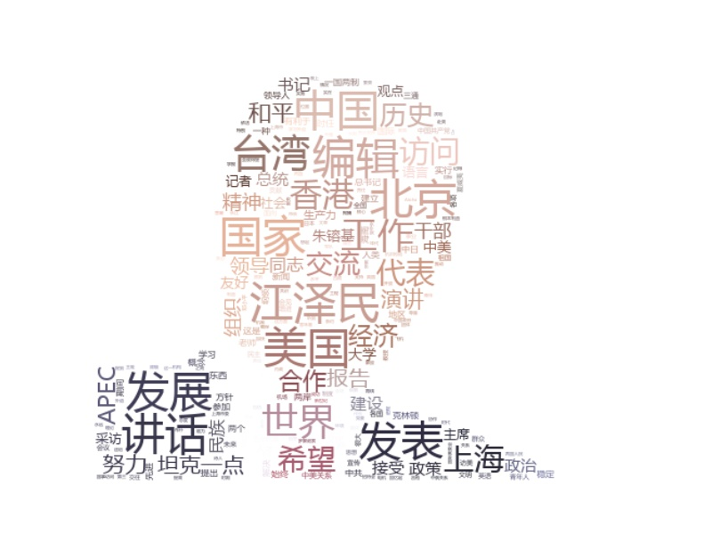

# 基于图片物体轮廓的中文词云生成
### 准备
- anaconda2
- cv2 (`conda install -c menpo opencv=2.4.11`)
- wordcloud (`pip install wordcloud`)
- jieba (`pip install jieba`)

### 使用例子
- example.py (直接生成)
> 原图 & 结果图

     
- example2.py (选定目标位置)
> 过程图 & 结果图

     

- example3.py (基于手工标记,左键绿色标记前景,右键红色标记背景)
> 过程图 & 结果图

     

### 一些说明
- 主要使用了wordcloud库与jieba库的中文分析,图像轮廓采用了grabCut算法,因此支持不同的方法来分割
- 采用了cv2库做界面交互
- 很惭愧,只做了点微小的工作

